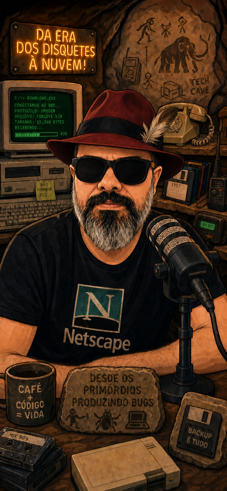

# Professional Portfolio

This repository presents Rob Moraes' professional portfolio as a focused,
responsive, and bilingual web experience. Its goal is to support executive
conversations, hiring processes, networking, and seniority evaluation with a
consolidated view of career trajectory, competencies, areas of expertise,
certifications, and complementary education.

The application is available at:

[portfolio.robmoraes.dev.br](https://portfolio.robmoraes.dev.br)

## Purpose

The portfolio was designed as a living professional presentation with structured
content that is easy to maintain. The experience prioritizes clarity, quick
reading, and credibility, bringing together information that is usually spread
across a resume, professional profile, certificates, and project history.

The project also works as a practical demonstration of frontend organization,
internationalization, automated publishing, and separation between content and
the visual layer.

## Stack

Built as an SPA with Quasar, Vue 3, Vite, Vue Router in hash mode, and Vue I18n.
The professional content is stored in locale-specific JSON files, and the
interface uses Quasar components, Material Icons, Font Awesome, and Vue Word
Cloud.

Technical repository details, structure, development commands,
internationalization, build, deployment, and contribution guidance are documented
in [docs/repository-guide.md](docs/repository-guide.md).
